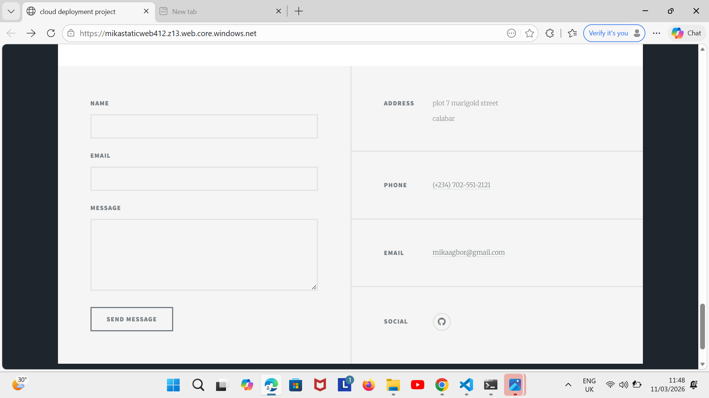
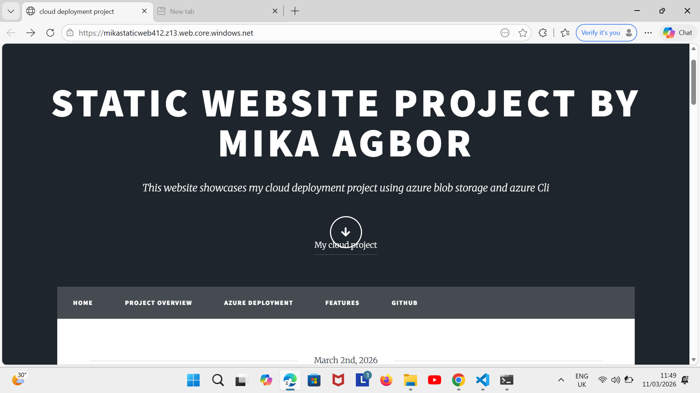
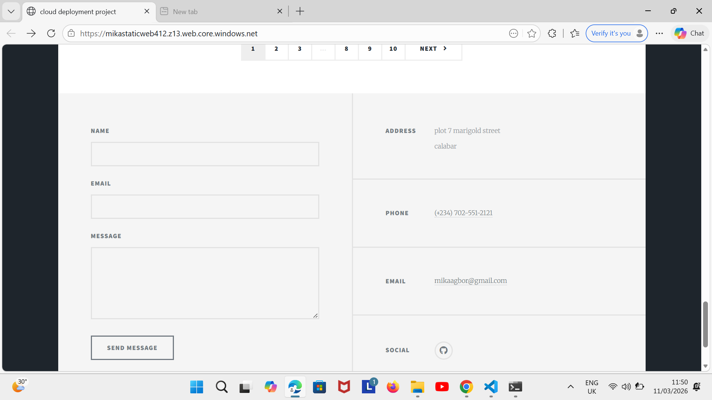
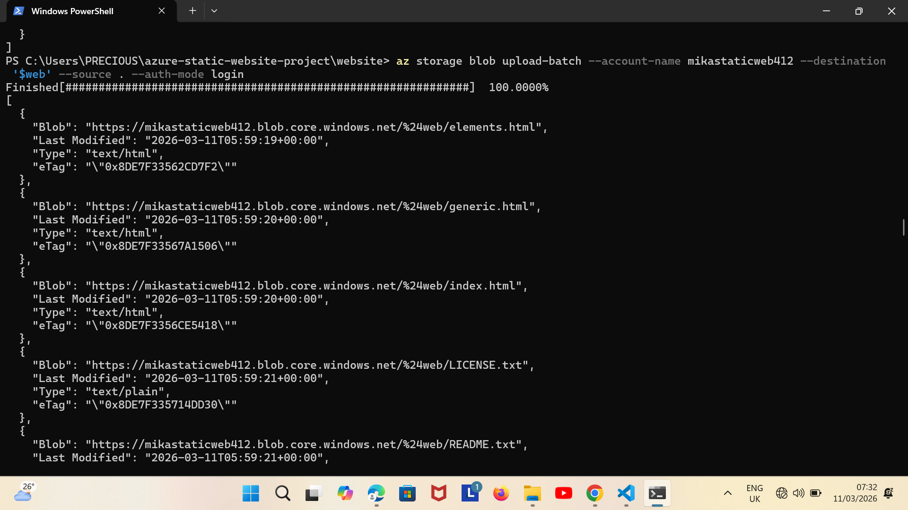
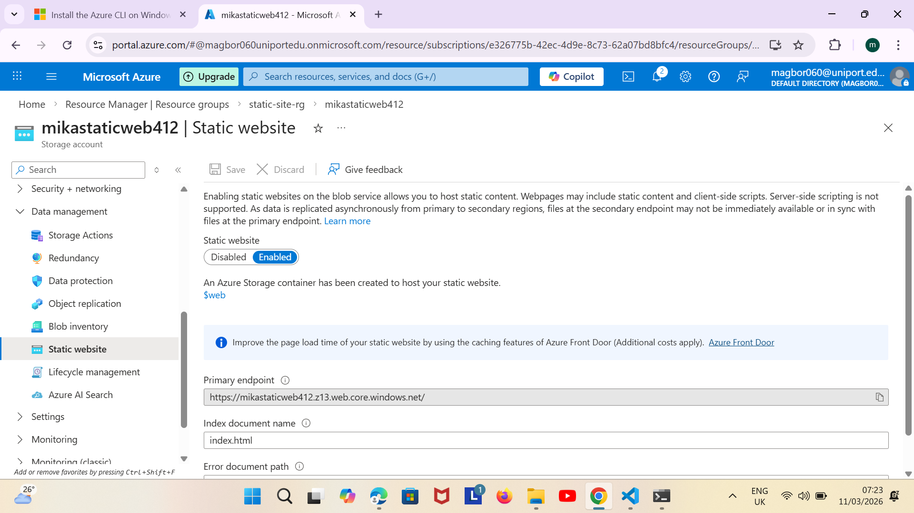
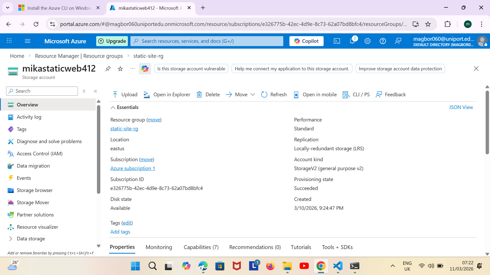
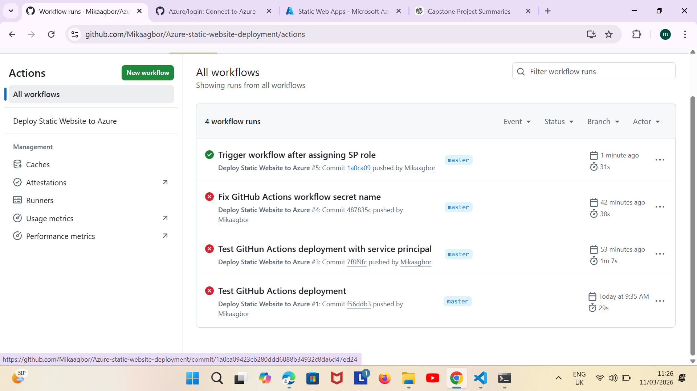

# Azure Static Website Project

## Project Overview
This is my static website deployment project for my capstone. The site is a text-heavy informational website built using the **Massively template** from HTML5 UP. It demonstrates how to host a static website on **Azure Blob Storage** and deploy updates using **Azure CLI** and **GitHub Actions**.

## Features
- Static informational content displayed through a clean user interface
- Hosted on Azure Blob Storage using static website hosting
- Automatic deployment through GitHub Actions when site files are updated
- Fully responsive and mobile-friendly layout

## Template Credits
- Template: **Massively** by HTML5 UP (html5up.net | @ajlkn)  
  Free for personal and commercial use under the CCA 3.0 license: [html5up.net/license](https://html5up.net/license)
- Demo Images: Unsplash (unsplash.com)
- Icons: Font Awesome (fontawesome.io)
- Libraries: jQuery, Scrollex, Responsive Tools

*Trigger GitHub Actions workflow for deployment test*

## Deployment Instructions
1. Clone this repository:
   ```bash
   git clone https://github.com/Mikaagbor/azure-static-website-deployment.git

## Screenshots

**live Websites**





**Azure CLI Deployments**


**Azure portal success**



**GitHub Actions Worflow run**
